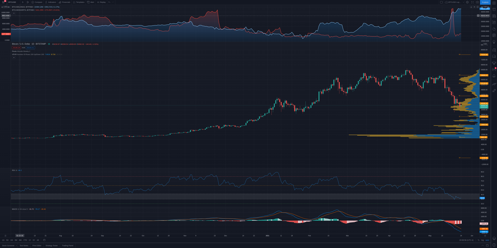
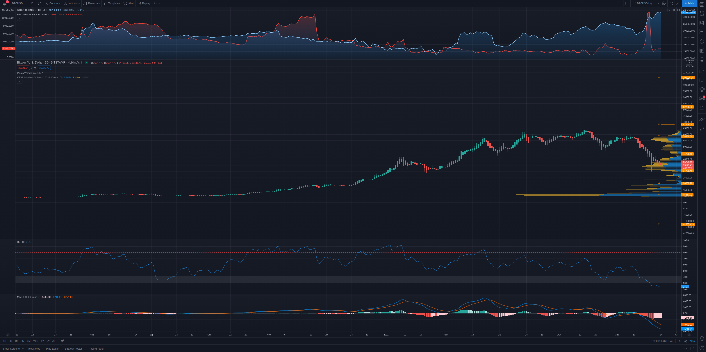

# Weekly Price Analysis - 5/23/21
## BTC [*35202*]

+ Le Pivot Woodie Weekly indique un pivot a 36546, un premier support (S1) a 26444 et une premiere resistance (R1) a 43026.  
+ Le VPVR indique un bon support de volume dans le range de prix (30-40K), a 24K et a 19K.
+ Le RSI-18 est a 32.6. Il est en dessous du trigger du 42. Donc, il est dans la zone de sous-evaluation et s'approche grandement du trigger du 30. La zone entre 20-30 est une zone de grande sous-evaluation et la zone en bas du trigger du 20 est une zone d'extreme sous-evaluation.  
+ Le MACD indique une MACD line en dessous de la signal line avec un bon ecart. Donc, c'est encore un bearish signal.

+ Le Heikin-Ashi candlestick est encore en downtrend, donc signal bearish. T'en que le Heikin-Ashi ne tombe pas en uptrend, le trend reste bearish.

*Si le BTC depasse son pivot avec du volume, on tomberait en bullish trend. Par contre, je ne m'attends pas a ce qu'il revienne toucher son pivot cette semaine, a moins d'une tres bonne nouvelle sur l'analyse fondamental. Donc, le BTC devrait aller rejoindre son S1 cette semaine. Le seul point bullish que je vois pour cette semaine est sur l'analyse fondamental. TSLA et plusieurs autre compagnies d'investissement ont embarque proche du prix actuel. Donc, cela peut etre une bonne affaire dans le sens que s'ils ne vendent pas, ca peut creer un pression a la hausse.*
