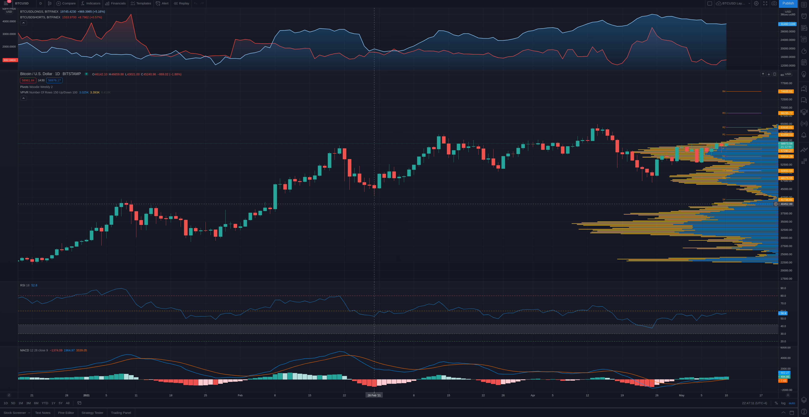

# Weekly Price Analysis - 5/9/21
## BTC [*58973*]

+ Le Pivot Woodie Weekly indique un pivot a 57290, un premier support (S1) a 57290 et une premiere resistance (R1) a 61656.  
+ Le VPVR indique un bon support de volume au prix actuel (entre 54500-59000).
+ Le RSI-18 est a 56.7. Il est en dessous du trigger du 60. Donc, s'il declanche le trigger du 60, le prix va aller rejoindre sa R1.
+ Le MACD indique une MACD line en plein sur la signal line. Donc signal neutre.

*Le prix devrait rester assez stable cette semaine, si le RSI-18 ne declanche pas le trigger du 60. Par contre, si ca vient a bouger, vers le haut ou vers le bas, il va y avoir un gros mouvement qui va se passer. Donc, a regarder pour cette semaine.*
