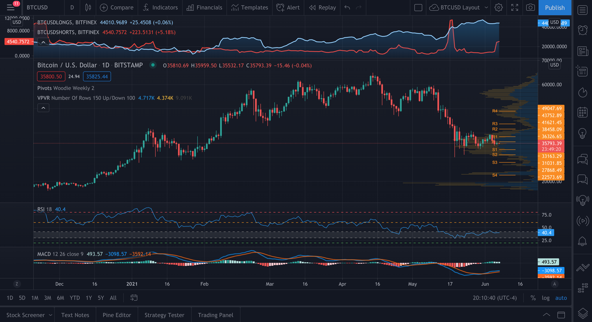
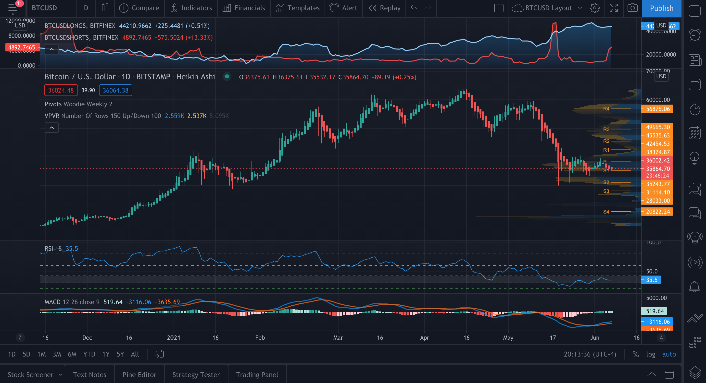
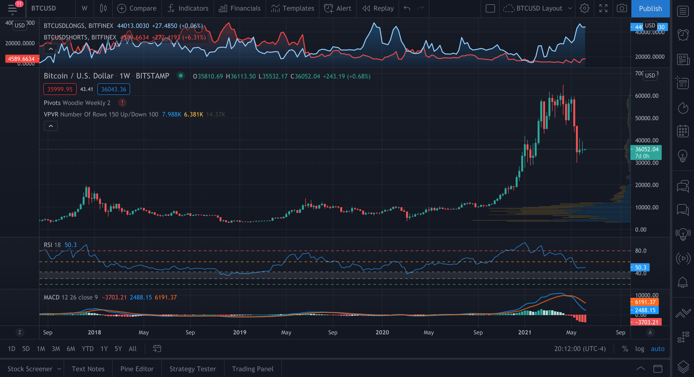
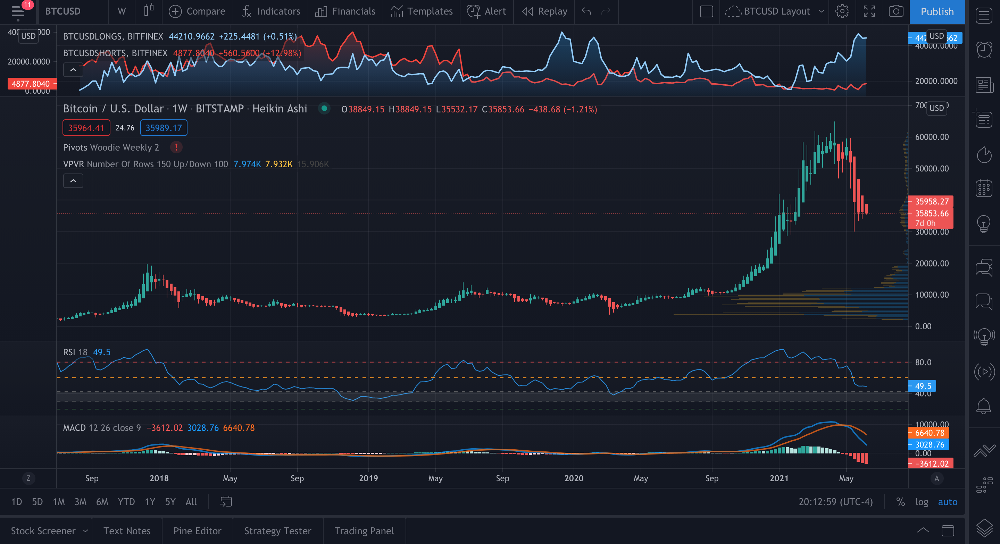

# Weekly Price Analysis - 6/6/21
## BTC [*36052*]

### BTC Chart - Daily Candles

+ Le Pivot Woodie Weekly indique un pivot a 36326, un premier support (S1) a 33163 et une premiere resistance (R1) a 38458.  
+ Le VPVR indique un bon support de volume dans le range de prix (30-40K), a 24K et a 19K.
+ Le RSI-18 est a 40.4. Il est en dessous du trigger du 42. Donc, il est dans la zone de sous-evaluation. La zone entre 42-60 est une zone neutre. La zone entre 20-30 est une zone de grande sous-evaluation et la zone en bas du trigger du 20 est une zone d'extreme sous-evaluation.
+ Le MACD indique une MACD line en haut de la signal line. Donc, un peu bullish comme signal. Par contre, l'ecart entre la MACD line et la signal line est vraiment mince, donc un revirement du signal trend peut facilement arriver.

### BTC Chart - Daily Heikin-Ashi

+ Le Heikin-Ashi candlestick est en downtrend. Donc, signal bearish encore pour l'instant.

### BTC Chart - Weekly Candles

+ Le RSI-18 est a 50.3. Il est dans la zone neutre, donc cela indique qu'il n'a pas encore atteint son bottom.
+ Ici encore, le weekly ne regardent pas bien. Comme la semaine passe, nous voyons un support se creer dans les prix actuels, mais la MACD line indique une trend encore tres bearish.
+ Il y a 2 possibilites pour que la MACD line se consolide:
    * Soit qu'il reste pas mal a ce niveau la pendant quelques semaines
    * Soit qu'il redescend dans les 20K et qu'il se stabilise la

### BTC Chart - Weekly Heikin-Ashi

+ Le heikin-Ashi candlestick est encore en downtrend assez marque. Donc, signal bearish.
+ Si on se fit a 2014 et a 2018, on pourrait voir un petit uptrend cette semaine, car a chaque fois que le BTC plante, il descend pendant 5 semaines et il monte pendant 3-4 semaines apres ca. Par contre, il n'y a aucun indicateur qui envisage une hausse cette semaine.
