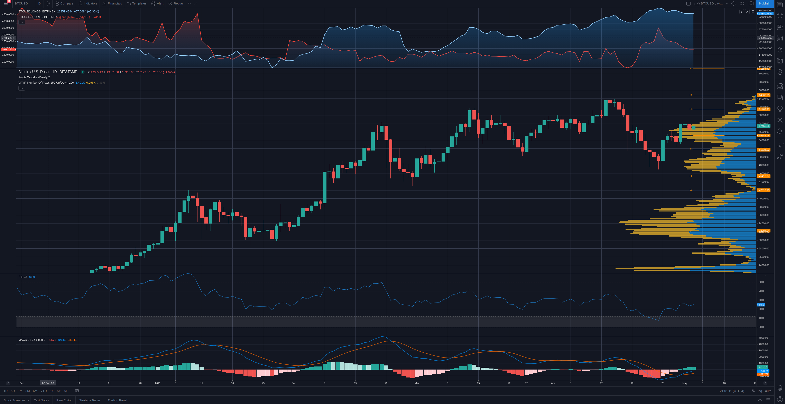

# Weekly Price Analysis - 5/2/21
## BTC [*57460*]

+ Le Pivot Woodie Weekly indique un pivot a 55142, un premier support a 51736 et une premiere resistance a 61462.  
+ Le VPVR indique un bon support de volume a 56500 et a 49300 environ.
+ Le RSI-18 est a 54.8. Il est en dessous du trigger du 60, mais il vient de traverser le trigger du 42 la semaine passe. Donc, possible hausse prochainement en haut du trigger du 60, qui declencherait une hausse du prix. Le prix pourrait possiblement rejoindre sa premiere resistance (61462), et donc, se rapprocher grandement de son ATH.
+ Le MACD indique une MACD line en haut de la signal line. La MACD line a recement croise la signal line vers le haut. En plus, la MACD et signal lines sont tombes dans le negatif la semaine passe. Chose qu'on avait pas vu depuis septembre 2020. Cela veut donc dire que la correction est fini. Donc, tres bullish here.  

*Le prix devrait aller rejoindre le R1 (premiere resistance a 61462) cette semaine. S'il rejette sa resistance, le prix devrait aller rejoindre son pivot (55142). S'il reussi a maintenir un bon niveau de volume au R1 (premiere resistance), on pourrait voir le prix atteindre et meme depasser son ATH cette semaine.*
