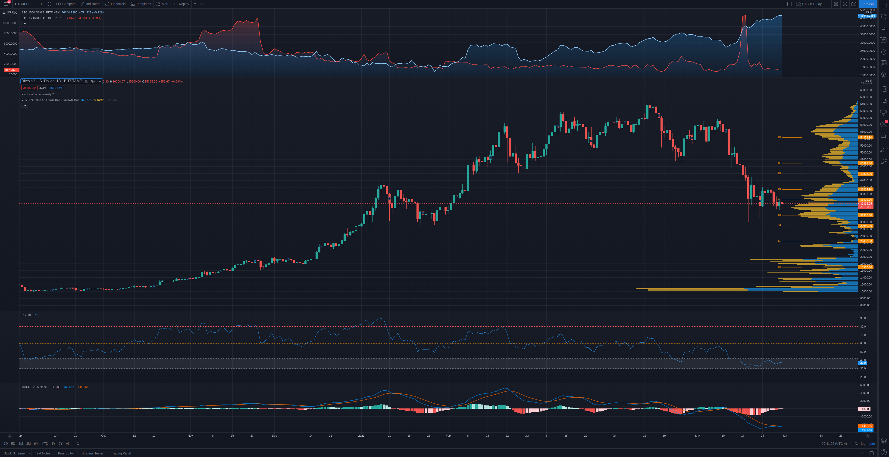
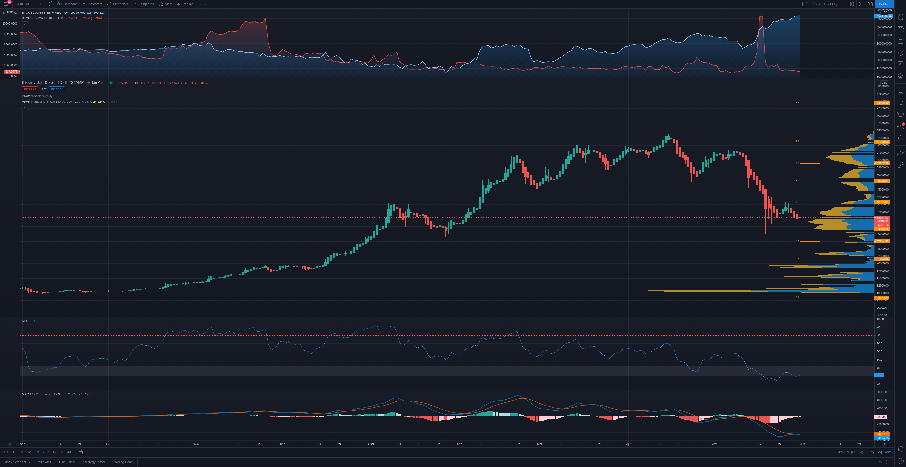
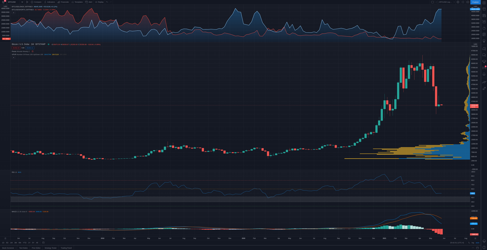
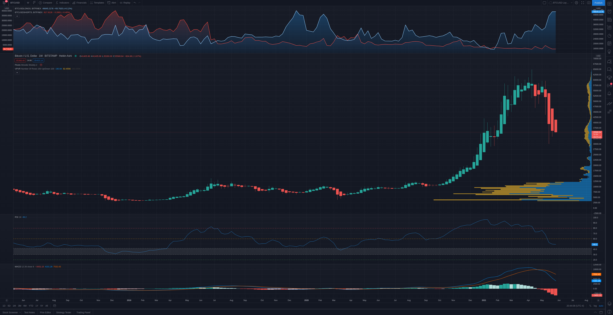

# Weekly Price Analysis - 5/30/21
## BTC [*35289*]

### BTC Chart - Daily Candles

+ Le Pivot Woodie Weekly indique un pivot a 36419, un premier support (S1) a 31935 et une premiere resistance (R1) a 39414.  
+ Le VPVR indique un bon support de volume dans le range de prix (30-40K), a 24K et a 19K.
+ Le RSI-18 est a 37. Il est en dessous du trigger du 42. Donc, il est dans la zone de sous-evaluation. La zone entre 42-60 est une zone neutre. La zone entre 20-30 est une zone de grande sous-evaluation et la zone en bas du trigger du 20 est une zone d'extreme sous-evaluation.
+ Le MACD indique une MACD line presque sur la signal line. Donc, c'est quand meme bullish comme signal.

### BTC Chart - Daily Heikin-Ashi

+ Le Heikin-Ashi candlestick est en downtrend, apres un petit uptrend la semaine passe. Donc, signal bearish encore pour l'instant.

### BTC Chart - Weekly Candles

+ Le RSI-18 est a 49.6. Il est dans la zone neutre, donc cela indique qu'il n'a pas atteint son bottom.
+ Les charts weekly ne regardent pas bien. Malgre le fait que nous voyons un support a 34700 environ se dessiner, la MACD line indique une trend encore tres bearish. Il faut que la MACD line depasse la signal line sur le weekly pour tourner en bullish trend. Je ne vois pas cela arriver d'ici aout, pour etre franc.
+ Il y a 2 possibilites pour que la MACD line se consolide:
    * Soit qu'il reste pas mal a ce niveau la pendant quelques semaines
    * Soit qu'il redescend dans les 20K et qu'il se stabilise la

### BTC Chart - Weekly Heikin-Ashi

+ Le heikin-Ashi candlestick est en downtrend assez marque. Donc, signal bearish.
+ Si on se fit a 2014 et a 2018, on pourrait voir un petit uptrend la semaine prochaine, car a chaque fois que le BTC plante, il descend pendant 5 semaines et il monte pendant 3-4 semaines apres ca.
+ Par contre, si on trace un vecteur partant de son ATH, la trend reste decendente.
